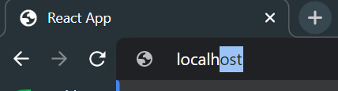
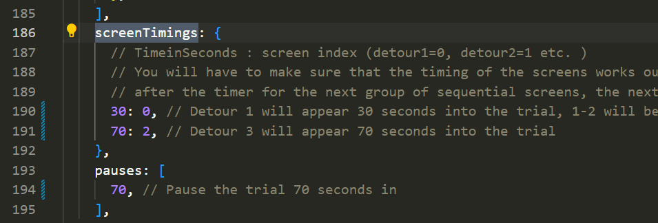
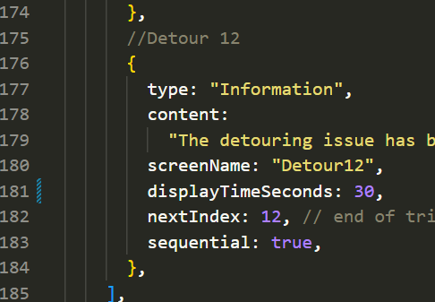
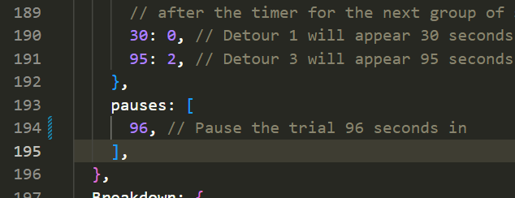
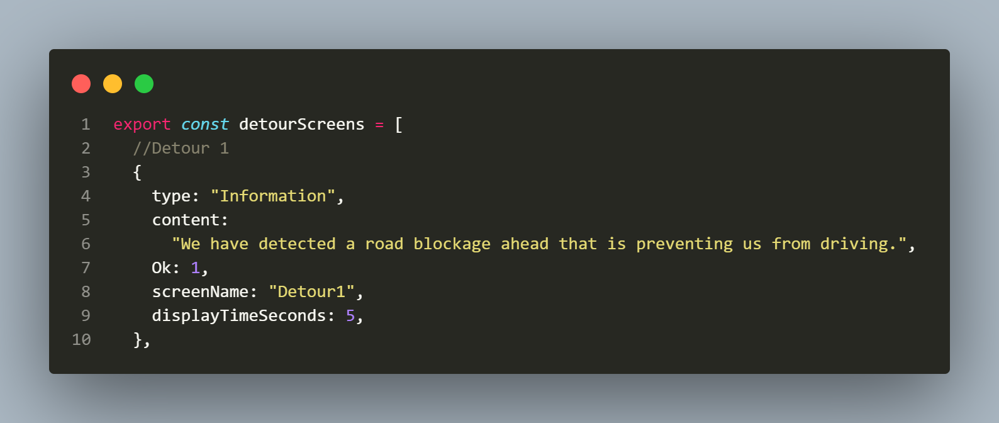

# Reed Laboratory Trials Management System

The Reed Laboratory Trials Management System is a client-server application developed for The Reed Laboratory at the University of Florida. It is designed to help perform trials in an ongoing study by providing an easy-to-use interface for managing and collecting trial data.

## Technologies Used

- React
- Node.js
- Express
- Sequelize (ORM)
- SQLite
- Redux
- Axios
- Styled Components
- Docker

## Features

- Client Application:

- Server Application:

- Button Box:

## Getting Started

### Prerequisites

- Node Package Manager (LTS version) https://nodejs.org/en/download
- git https://git-scm.com/downloads


### Get the Latest Version 

*Prior to changing versions remember to save you db if applicable. It will be found under dua_server/db/Trial_Data.db. Put that db inside of the new project to maintain the same db between updates. 

*The videos for this project are saved separately. Obtain the needed videos and put them inside of dua_client/src/assets for the project to run. This will be needed between each re-installation too. 

( In the command line )

1. Clone the repository:
   -git clone https://github.com/winansb/DUA.git (alternatively download from this link)

2. Run both update scripts to make sure all dependencies are present for the server and client.

### Run the project

1. Run both start scipts, one for the client and one for the server. 

2. If a window does not automatically open, you can now access the project by opening your browser and inputting 'localhost'. This project was tested for and developed with google chrome. Image below is dated and should be localhost:3000


3. You are now running the project and should see this page 

   


## How to Edit Trials

### How to change trial screen timings 

Edit screenTimings inside of dua_client/src/data/TrialData.js. Time measured in seconds since the start of the trial. 



### How to change screen durations 

Edit displayTimeSeconds entry within the screens arry in dua_client/src/data/TrialData.js. Time measured in seconds from when the screen first appeared. 



### How to change pauses during trials 

Edit the pauses array for the corresponding trial type in dua_client/src/data/TrialData.js.Time is measured in seconds from the start of the trial. 




Trials are composed from a series of components generated from one array per a trial. Arrays can be as long or short as you like and cover three basic screens. To create a new screen or edit old ones navigate to dua_client/src/views/components/IVA_Components/Trial_Info/TrialInformation.js. This file contains the three arrays responsible for defining trial behavior. There are DetourScreens, DetourScreenTimings, and detourPauses and the equivalent for the breakdown test. Simply edit the text in these files and save them for most changes.

### Information Screen



Displays an Ok button and text to the user
-type: "Information",
-content: "any text in double quotes that you want to show on the screen."
-nextIndex: The index of the next screen within the 'test'Screens array to show after this screen is finished. If you want Detour2 to display as the next screen after the user presses okay you would but 1 here.
-screenName: the name used for data collection techniques when communicating on what sreen something happened such as action initiated. Detour1_Ok.
-displayTimeSeconds: integer describing the seconds this screen should stay open for before closing.

### Prompt Screen

Displays Yes or no option, takes 'content' as an argument. This is a jsx object that portrays what will show on the screen that pops up during the trial over the default UI.

-

### Notif Screen

### Editing Trials

## Contributing

## Project File Structure
```
├─ .gitignore
├─ .prettierignore
├─ assets
  ├─ Home_Page.png
  ├─ Information_screen_code.png
  ├─ Navigation.png
  ├─ Server_running.png
├─ Button_Box
  ├─ CMakeLists.txt
  ├─ pico_sdk_import.cmake
  ├─ README.md
  ├─ src
    ├─ communication.h
    ├─ main.c
    ├─ main.h
├─ docker-compose.yml
├─ docs
  ├─ button_box.md
  ├─ communication.md
  ├─ components.md
  ├─ creating_db_tables.md
  ├─ creating_new_trial_scenario.md
  ├─ creating_unit_tests.md
  ├─ database.md
  ├─ docker.md
  ├─ redux.md
├─ dua_client
  ├─ config.env
  ├─ Dockerfile
  ├─ package-lock.json
  ├─ package.json
  ├─ public
    ├─ index.html
    ├─ manifest.json
  ├─ src
    ├─ apiRoutes.js
    ├─ App.js
    ├─ assets
      ├─ Breakdown_Breakdown.mp4
      ├─ Breakdown_Not_Pull_Over.mp4
      ├─ Breakdown_Pull_Over.mp4
      ├─ CarSettings.png
      ├─ DetourMap.png
      ├─ Detour_Construction.mp4
      ├─ Detour_Home.mp4
      ├─ Detour_Waffle_House.mp4
      ├─ Detour_Walgreen.mp4
      ├─ EntertainmentApp.png
      ├─ HomeMap.png
      ├─ PhoneApp.png
      ├─ PhoneButton.png
      ├─ PhoneCallEnd.png
      ├─ PhoneScreen.png
      ├─ Roadside_AssistancePhoneCall.png
      ├─ StartMap.png
      ├─ TwoPhones.png
      ├─ WaffleHouseMap.png
    ├─ controllers
      ├─ participantController.js
      ├─ screenController.js
      ├─ tapController.js
      ├─ testController.js
      ├─ trialController.js
    ├─ css
      ├─ styles.css
    ├─ data
      ├─ GeneralData.js
      ├─ TrialData.js
    ├─ index.js
    ├─ models
      ├─ screen.js
      ├─ trial.js
    ├─ redux
      ├─ actions
        ├─ participantActions.js
        ├─ screenActions.js
        ├─ tapActions.js
        ├─ testActions.js
        ├─ trialActions.js
      ├─ reducers
        ├─ participantReducer.js
        ├─ screenReducer.js
        ├─ tapReducer.js
        ├─ testReducer.js
        ├─ trialReducer.js
    ├─ store.js
    ├─ styles.css
    ├─ views
      ├─ components
        ├─ ButtonBoxGUI
          ├─ ColorPicker.js
          ├─ KeyCodeGetter.js
        ├─ Forms
          ├─ ParticipantConfirmForm.js
          ├─ ParticipantInputForm.js
          ├─ ParticipantSubmitForm.js
        ├─ General
          ├─ FunctionButton.js
          ├─ GeneralModal.js
          ├─ NavButton.js
          ├─ ReturnButton.js
        ├─ TrialScreens
          ├─ Detour
            ├─ Detour10Content.js
            ├─ Detour3Content.js
            ├─ Detour4Content.js
            ├─ Detour5Content.js
            ├─ Detour6Content.js
            ├─ Detour7Content.js
            ├─ Detour8Content.js
            ├─ Detour9Content.js
            ├─ DetourGoogleMaps.js
          ├─ TapRecording.js
          ├─ Trial_Info
            ├─ TrialInformation.js
        ├─ TrialSetup
          ├─ ParticipantTable.js
          ├─ TrialButton.js
        ├─ TrialVideos
        ├─ VehicleUI
          ├─ ButtonColumn.js
          ├─ DefaultDisplay.js
          ├─ InteractiveMap_INCOMPLETE.js
          ├─ TrialScreen.js
          ├─ TrialScreenCall.js
          ├─ TrialScreenInformation.js
          ├─ TrialScreenNotif.js
          ├─ TrialScreenPrompt.js
          ├─ TripTravelTime.js
          ├─ VehicleDate.js
      ├─ screens
        ├─ ButtonBoxGUI.js
        ├─ ExportToCSV.js
        ├─ HomePage.js
        ├─ ThankYou.js
        ├─ TrialRun.js
        ├─ TrialSetupContainer.js
        ├─ TrialVideoContainer.js
        ├─ VehicleUIContainer.js
├─ dua_server
  ├─ api
    ├─ api.js
    ├─ controllers
      ├─ participantController.js
      ├─ screenController.js
      ├─ tapController.js
      ├─ testController.js
      ├─ __tests__
        ├─ participantController.test.js
        ├─ screenController.test.js
        ├─ tapController.test.js
        ├─ testController.test.js
    ├─ models
      ├─ Participant.js
      ├─ Screen.js
      ├─ Tap.js
      ├─ Test.js
  ├─ config.env
  ├─ configDB
    ├─ database.js
  ├─ db
    ├─ initializer.js
    ├─ Trial_Data.db
  ├─ Dockerfile
  ├─ package-lock.json
  ├─ package.json
  ├─ README.md
  ├─ server.js
├─ file_structure.py
├─ README.md
├─ Start.cmd
├─ Stop.cmd
```

## Documentation

- [Communication](./docs/communication.md)
- [Button Box](./docs/button_box.md)
- [Redux](./docs/redux.md)
- [Components](./docs/components.md)
- [Docker](./docs/docker.md)
- [Database](./docs/database.md)
- [DUA Server](./dua_server/README.md)
- [Creating DB Tables](./docs/creating_db_tables.md)
- [Creating New Trial Scenarios](./docs/creating_new_trial_scenario.md)
- [Creating Unit Tests](./docs/creating_unit_tests.md)