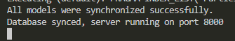
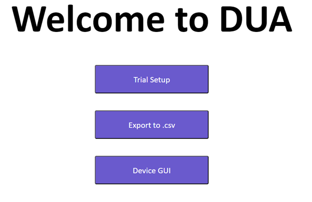

# Reed Laboratory Trials Management System

The Reed Laboratory Trials Management System is a client-server application developed for The Reed Laboratory at the University of Florida. It is designed to help perform trials in an ongoing study by providing an easy-to-use interface for managing and collecting trial data.

## Technologies Used

- React
- Node.js
- Express
- Sequelize (ORM)
- SQLite
- Redux
- Axios
- Styled Components

## Features

- Vehicle UI:

- MVC server:

- Button Box:

## Getting Started

### Prerequisites

- git https://git-scm.com/downloads
- Node.js (version 18.16.0 or higher) https://nodejs.org/en

### Installation

( In the command line )

1. Clone the repository:
   -git clone https://github.com/winansb/DUA.git

2. Install the dependencies:
   (with Node.js installed)
   double click Install Dependencies

   Alternatively in the command line
   -Navigate to /DUA/dua_client/ and use "npm install"
   -Navigate to /DUA/dua_server/ and use "npm install"

3. Start the server:
   Double click the start_server.cmd file
   Or navigate into the dua_server dir and use "npm start"

   You will know the server is working when you see this
   

4. Start the Client:
   double click the start_client.cmd file
   Or navigate into the dua_client dir and use "npm start"
   

   You are now running the project!

## Usage

### Editing Trials

## Contributing
